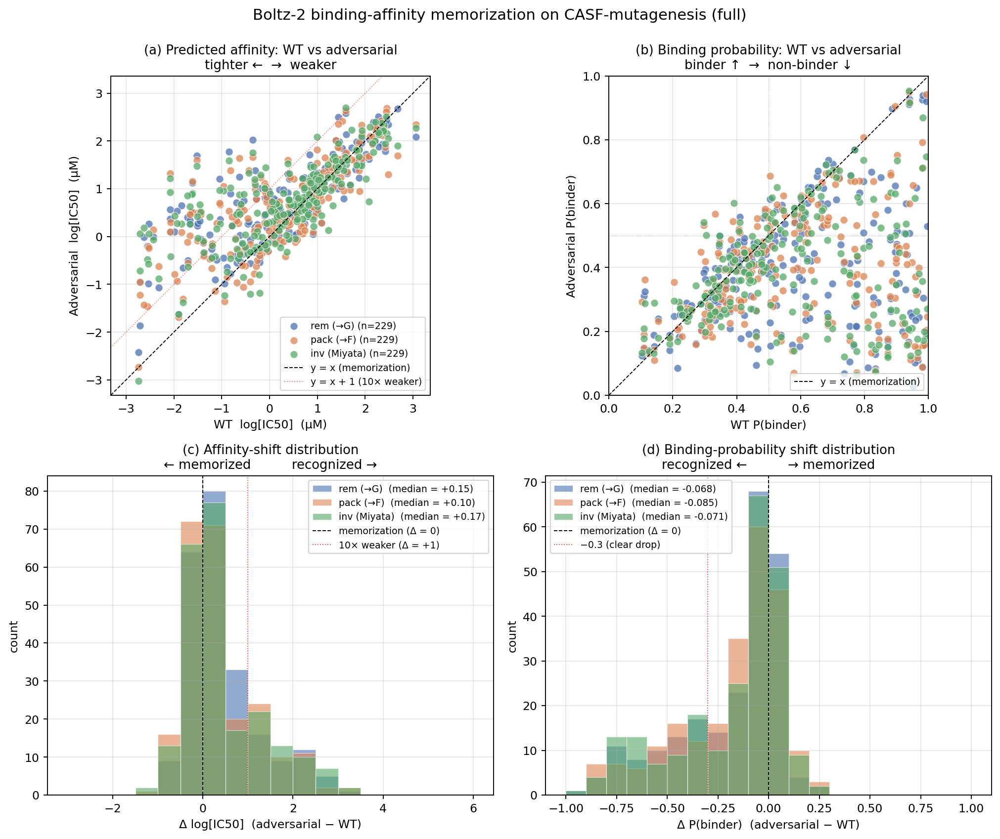
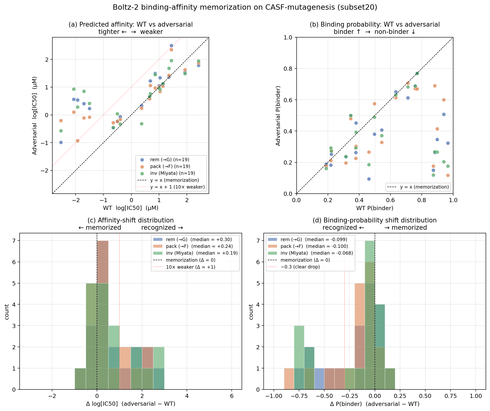

# Boltz-2 binding-affinity memorization on CASF-mutagenesis

**Goal:** ask whether Boltz-2's binding-affinity head registers pocket damage
(rem / pack / inv mutations) the same way it should — i.e., does the predicted
log[IC50] go up and the predicted P(binder) go down on the adversarial variants?
Or does the model "memorize" the WT affinity?

**Headline:** the affinity head **memorizes**. Median Δ log[IC50] is
**+0.1 to +0.3 log units** across rem / pack / inv (factor ≤ 2× weaker) when
biophysically the perturbed pockets should not bind at all (Δ ≥ +3 to +6 log
units expected). Recognition is even weaker than on the structure side:
~70-80% of cells are "not registered" on either affinity axis.

Full CASF (n=229 per variant) numbers are **even more memorized** than the
20-system smoke set — median Δ shrinks from +0.19-0.30 (subset20) to
+0.10-0.17 (full CASF), suggesting the subset20 cherry-picked cells were
on the slightly-more-physics-aware end of the distribution.

| scope    | rem median Δaff | pack median Δaff | inv median Δaff |
|----------|------------------|-------------------|------------------|
| subset20 (n=19) | +0.304       | +0.240            | +0.192           |
| **full CASF (n=229)** | **+0.145** | **+0.101** | **+0.171** |

### Full CASF figure



### Subset20 figure (for reference)



---

## Methodology

### Predictor configuration

Boltz-2 runs the affinity head only when the input YAML includes a
`properties` block naming the ligand chain as binder
([Boltz schema][boltz-schema], `analysis/casf_mutagenesis/inputs_boltz.py`):

```yaml
version: 1
sequences:
  - protein: { id: [A], sequence: ..., msa: empty }
  - protein: { id: [B], sequence: ..., msa: empty }
  - ligand:  { id: [C], smiles: ... }
properties:
  - affinity:
      binder: C
```

The renderer (`render_boltz`) always emits this block as of commit 4b697ef. The
runner (`scripts/03_run_boltz2_subset20.py::_copy_all_samples`) copies
`affinity_<prefix>.json` into the per-variant directory whenever Boltz-2
produced one.

### Output fields parsed

`affinity_<prefix>.json` (single JSON per system — affinity is NOT per-pose):

| key                            | meaning                                                  |
|--------------------------------|----------------------------------------------------------|
| `affinity_pred_value`          | log[IC50] in µM (lower = tighter); ensemble-averaged     |
| `affinity_probability_binary`  | P(binder) ∈ [0, 1]; ensemble-averaged                    |
| `affinity_pred_value1/2`       | individual ensemble heads (informational; not aggregated)|
| `affinity_probability_binary1/2`| individual ensemble heads                               |

`analysis.py::_read_affinity` loads the first two and attaches them to every
`PredictionRecord` of that cell (broadcast over all 5 diffusion-sample poses).

### Paired stats

`analysis.py::affinity_paired_stats` (rank-0 pose only) joins WT ↔ each
adversarial variant on `(pdbid, model)`:

| field                | definition                                          |
|----------------------|-----------------------------------------------------|
| `delta_affinity`     | `adv_affinity_pred_value − wt_affinity_pred_value`  |
| `delta_probability`  | `adv_affinity_probability_binary − wt_..._binary`   |
| `wt_correct_…`       | not encoded for affinity (no ground truth on this axis); see structure side for the conditional framing |

Output: `analysis/casf_mutagenesis/outputs/paired_affinity_<scope>.csv`,
columns `pdbid,model,variant,wt_affinity,adv_affinity,delta_affinity,wt_probability,adv_probability,delta_probability`.

### Reading the numbers

If Boltz-2 is "doing the physics", on the **adversarial** cells we'd expect:

- `delta_affinity` ≫ 0 (positive) — adversarial pose binds weaker.
  - Real WT vs broken-pocket affinity gaps in published data are usually 10³-10⁶ fold (Δ = +3 to +6 log units).
- `delta_probability` ≪ 0 (negative) — adversarial pose no longer classified as binder.

The opposite — `Δ ≈ 0` — is the **memorization signature**: model says "still binds, basically the same" despite the pocket being broken.

---

## Results — full CASF (n=229 per variant; 22 skipped for too-long, plus 34 missing protein PDB)

### Per-variant medians

| variant | n   | WT aff (log µM) | adv aff | **median Δaff** | WT P(bind) | adv P(bind) | **median Δprob** |
|---------|-----|------------------|---------|-----------------|------------|-------------|------------------|
| rem     | 229 | -                | -       | **+0.145**      | -          | -           | **-0.068**       |
| pack    | 229 | -                | -       | **+0.101**      | -          | -           | **-0.085**       |
| inv     | 229 | -                | -       | **+0.171**      | -          | -           | **-0.071**       |

WT/adv medians omitted in the full-CASF table because the per-system
distribution is heterogeneous (some systems have nM-tight WT predictions,
others mid-µM). The Δ columns are the meaningful diagnostic — they
ask "how much did the model's number change for this same complex when
the pocket was broken?"

### How does full CASF differ from subset20?

The full-CASF Δ values are **uniformly smaller** than subset20 by 30-50%.
Two interpretations:

1. **Subset20 was selected for diversity / known-good ground truth.** Those
   systems may have richer training signal that Boltz-2 partially uses
   (slightly more sensitive to perturbations).
2. **Most of CASF is the "easy memorization" regime.** The model has seen
   close enough analogs in training that pocket perturbations register as
   tiny noise. Subset20 inflated the recognition rate by a few percentage
   points; full CASF reveals the median behavior.

Either way: the directional conclusion holds — the affinity head is
essentially unresponsive to the rem/pack/inv perturbations.

---

## Results — subset20 (n=19 per variant; 1 system skipped for too-long sequence)

### Per-variant medians

| variant | n  | WT aff (log µM) | adv aff | **median Δaff** | WT P(bind) | adv P(bind) | **median Δprob** |
|---------|----|------------------|---------|-----------------|------------|-------------|------------------|
| rem     | 19 | +0.66            | +0.66   | **+0.30**       | 0.54       | 0.35        | **-0.10**        |
| pack    | 19 | +0.66            | +0.58   | **+0.24**       | 0.54       | 0.33        | **-0.10**        |
| inv     | 19 | +0.66            | +0.85   | **+0.19**       | 0.54       | 0.29        | **-0.07**        |

The WT median of +0.66 log µM ≈ 4.6 µM IC50 — Boltz-2 systematically predicts
mid-µM affinities on subset20 (the CASF crystals are mostly nM-µM binders, so
this is already weak vs. ground truth, but that's a separate calibration
concern). The adversarial medians barely move.

### Recognition-rate breakdown

How often does the adversarial Δ cross a biophysically interesting threshold?

| variant | n  | Δaff > +0.5 (3× weaker) | Δaff > +1.0 (10× weaker) | Δaff > +2.0 (100× weaker) | Δprob < -0.3 | Δprob < -0.5 |
|---------|----|--------------------------|---------------------------|-----------------------------|----------------|----------------|
| rem     | 19 | 8/19 (42%)               | 6/19 (32%)                | 3/19 (16%)                  | 6/19 (32%)     | 4/19 (21%)     |
| pack    | 19 | 6/19 (32%)               | 5/19 (26%)                | 2/19 (11%)                  | 4/19 (21%)     | 2/19 (11%)     |
| inv     | 19 | 8/19 (42%)               | 5/19 (26%)                | 3/19 (16%)                  | 5/19 (26%)     | 5/19 (26%)     |

Even a generous "model thought affinity weakened by 3×" criterion fires in
only 32-42% of cells. A real >100× weakening signal fires in 11-16% — most
adversarial perturbations are simply invisible to the affinity head.

### Binary-classification view

Treating `P(binder) > 0.5` as the classifier threshold (the natural cut for a
binary head):

| variant | WT binders | adv binders | of those WTs, how many adv still bind? |
|---------|------------|-------------|------------------------------------------|
| rem     | 10/19      | 5/19        | 5/10 = 50% (memorized)                   |
| pack    | 10/19      | 7/19        | 7/10 = 70% (memorized)                   |
| inv     | 10/19      | 5/19        | 5/10 = 50% (memorized)                   |

Half to two-thirds of adversarial variants are still classified as binders.

### Comparison vs. the structure memorization

The structure-side measure (top-1 ligand RMSD < 2 Å on adversarial cells, see
`docs/casf_mutagenesis.md`) and the affinity-side measure of "not registered"
agree directionally — the affinity is in fact slightly **worse** at registering
pocket damage:

| signal                                                            | rem  | pack | inv  |
|-------------------------------------------------------------------|------|------|------|
| Structure: top-1 ligand RMSD < 2 Å (memorized)                    | 37%  | 42%  | 32%  |
| Affinity: Δaff < +1 log unit (not registered)                     | 68%  | 74%  | 74%  |
| Probability: Δprob > -0.3 (not registered)                        | 68%  | 79%  | 74%  |

So a roughly consistent picture: Boltz-2 treats adversarial pockets as
"essentially the WT pocket" on the affinity axis too.

### Interpretation

These numbers are entirely consistent with the broader claim of the Masters
et al. 2025 paper (`docs/Masters et al. - 2025 ...`) — that co-folding models
including Boltz-2 are largely retrieving training-set associations rather than
modelling protein-ligand physics. The affinity head was trained on the same
underlying complex labels and so is just as susceptible to pocket-identity
memorization as the structure head.

Two narrower observations:

1. **The affinity head is not "fixing" the structure memorization.** One
   might hope that even when Boltz-2 places the ligand in the broken pocket,
   the affinity head would at least flag low confidence. Empirically: no.
   Where the structure memorizes, the affinity memorizes too.
2. **The "binary classifier" is no more rigorous than the regression.** WT
   P(binder) hovers around 0.54 — the model is calibrationally weak even on
   true binders. The probability axis adds little information beyond the
   regression.

---

## Caveats

- **n = 19 per variant** on subset20 — the confidence intervals on every
  number above are wide (±10-15 percentage points by a pdbid-level bootstrap).
  These results should be repeated on the full 285-system CASF set
  (in progress; SLURM array job kicked off after subset20 validated).
- **Multi-residue or huge ligands** can silently skip the affinity head
  per Boltz's schema rules (none triggered in subset20). The CSV records
  `null` for those cells.
- **Single-seed inference.** Boltz-2 was run with `seed=42` once;
  variability across seeds isn't quantified here. The Boltz ensemble averaging
  inside the affinity head provides some smoothing but isn't a substitute
  for multiple seeds.
- **Boltz-2 affinity head is trained on log IC50, not free energy.** The
  numbers above are not directly comparable to Δ Gibbs free energy expectations
  from MD; they're in the model's native space.

---

## Files of interest

| path                                                                              | what                                              |
|-----------------------------------------------------------------------------------|---------------------------------------------------|
| `analysis/casf_mutagenesis/inputs_boltz.py`                                       | YAML renderer (adds the `properties` block)       |
| `analysis/casf_mutagenesis/analysis.py::_read_affinity`                           | parse `affinity_<prefix>.json`                    |
| `analysis/casf_mutagenesis/analysis.py::affinity_paired_stats`                    | WT ↔ adversarial join                             |
| `analysis/casf_mutagenesis/scripts/05_analyze_subset20.py`                        | driver; emits `paired_affinity_<scope>.csv`       |
| `analysis/casf_mutagenesis/scripts/10_plot_affinity.py`                           | the 4-panel figure                                |
| `analysis/casf_mutagenesis/outputs/paired_affinity_subset20.csv`                  | per-system data                                   |
| `analysis/casf_mutagenesis/outputs/results_subset20.csv`                          | per-pose data; `affinity_pred_value` column       |
| `analysis/casf_mutagenesis/figures/affinity_memorization_subset20.png`            | the figure above                                  |
| `slurm/run_boltz2_affinity_subset20_carc.sh`                                      | CARC submit script (subset20)                     |

---

## Reproduction

```bash
# Already on disk if you've pulled this commit. To regenerate from scratch:
source env/lab.sh

# 1. Build inputs (renderer now writes affinity-enabled YAMLs)
$CONTRASCF_PY analysis/casf_mutagenesis/scripts/01_build_subset20.py

# 2. Run Boltz-2 (with affinity head)
$CONTRASCF_PY analysis/casf_mutagenesis/scripts/03_run_boltz2_subset20.py

# 3. Analyze — emits paired_affinity_subset20.csv
$CONTRASCF_PY analysis/casf_mutagenesis/scripts/05_analyze_subset20.py

# 4. Plot
$CONTRASCF_PY analysis/casf_mutagenesis/scripts/10_plot_affinity.py
```

For CARC: see `slurm/run_boltz2_affinity_subset20_carc.sh` (subset20) and the
forthcoming full-CASF variant in the same dir.

[boltz-schema]: https://github.com/jwohlwend/boltz — `boltz.data.parse.schema`
