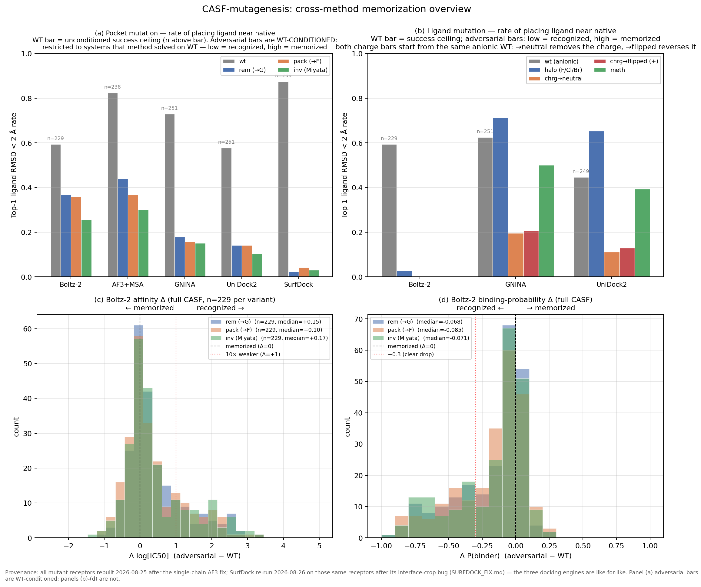

# CASF-mutagenesis study: cross-method overview

This is the bird's-eye-view of the contrasCF secondary analysis: across
**5 methods × 2 mutation modules × 2 signal axes**, what do we see?

For the deep dives, see the per-topic docs:

- [`casf_mutagenesis.md`](casf_mutagenesis.md) — pocket-mutation methodology, build pipeline, AF3/Boltz-2 structure side
- [`ligand_mutagenesis.md`](ligand_mutagenesis.md) — ligand-mutation methodology, halogenation/charge/methylation rules
- [`casf_affinity.md`](casf_affinity.md) — Boltz-2 binding-affinity head, the only co-folding model with an affinity signal
- [`casf_confidence.md`](casf_confidence.md) — confidence × affinity × RMSD: the three heads dissociate (confidence registers the broken pocket; affinity is near-blind)

## The cross-method matrix today

| signal                            | Boltz-2          | AF3 (no MSA)    | AF3+MSA           | GNINA            | UniDock2         | SurfDock  |
|-----------------------------------|------------------|-----------------|-------------------|------------------|------------------|-----------|
| **Pocket mutation** (rem/pack/inv) | | | | | | |
| Ligand RMSD vs crystal             | ✓ full CASF (n=229) | subset20 only (n=19) | ✓ full CASF (n=238-239) | ✓ full CASF (n=239) | ✓ full CASF (n=239) | ⚠️ **RETRACTED** — old cells invalid (surface-prep bug, fixed 2026-08-25); needs re-run, see below |
| Confidence (iptm/ptm/rs)           | ✓                | ✓               | ✓                 | n/a              | n/a              | confidence in SDF tags |
| Affinity head (log[IC50] + P)      | ✓ **full CASF**  | — (no head)     | — (no head)       | n/a              | n/a              | n/a       |
| Best-of-5 poses                    | ✓                | ✓ (subset20)    | ✓ (subset20)      | n/a (single pose)| n/a              | ✓ (top-10) |
| **Ligand mutation** (halo/chrg/meth) | | | | | | |
| Ligand RMSD vs crystal             | ✓ **full CASF (n=204 halo, ~42 chrg/meth)** | —             | —                 | ✓ subset20 (n≤251) | ✓ subset20 (n≤101) | not yet (would extend runner to walk ligand_mutagenesis outputs) |
| Confidence                         | ✓ rsynced            | —     | —                 | n/a              | n/a              | n/a       |
| Affinity head                      | ✓ **full CASF (n=959 paired rows)** | —     | —                 | n/a              | n/a              | n/a       |

### Ligand-side Boltz-2 dichotomy (added 2026-05-23)

Now that Boltz-2 results are in for both modules, a startling cross-axis
pattern shows up — Boltz-2's structure head and affinity head **disagree**
on the ligand-mutation side:

| signal           | WT rate    | adversarial rate     | physics signature |
|------------------|------------|----------------------|-------------------|
| Structure (RMSD < 2 Å)   | 59% (n=229) | **0-3% (all variants)**  | **good** — model says "I don't know where to place this variant" |
| Affinity (Δ log[IC50])   | baseline   | **negative median for almost every variant** (-0.04 to -0.65) | **bad** — model says "and it binds **tighter**" |
| Probability (Δ P(binder))| baseline   | slight negative (-0.02 to -0.16) | mild — small drop |

Concretely:

| variant group | n | median Δaff | median Δprob | structure-correct rate |
|---------------|---|-------------|--------------|------------------------|
| halo (F/Cl/Br swap)       | 588 | −0.18 | −0.02 | 2.5-2.9% |
| chrg→neutral (+alkyl)     | 126 | **−0.46** | −0.13 | 0% |
| chrg→positive (+ammonium) | 126 | −0.05 | −0.11 | 0% |
| methylation (1-5 methyls) | 119 | +0.07     | −0.08 | 0% |

The chrg→neutral case is the most extreme — Boltz-2 thinks attaching long
tert-butyl chains to the carboxylate of an amino-acid-like ligand makes
it bind **tighter by a factor of 3** (median −0.46 log[IC50]). Biophysically,
that perturbation eliminates an important polar contact and adds bulk
the pocket can't accommodate; affinity should drop by many orders of
magnitude. The structure head correctly refuses to place these molecules
(0% < 2 Å), but the affinity head doesn't notice — its training likely
encoded "more heavy atoms ≈ better contacts ≈ better predicted affinity".

This isn't a single-cell artifact: the affinity-head failure spans 700+
adversarial cells across 4 perturbation rules and 200+ different proteins.
And it directly contradicts what the affinity head would need to do to
serve as a reliable physics-aware reranker on the structure side.

For the figure: see
`analysis/ligand_mutagenesis/figures/affinity_memorization_ligand.png`
(4-panel ligand-side affinity figure analogous to the casf-side one).

---

### SurfDock CASF result — RETRACTED, numbers invalid (2026-08-25)

**The SurfDock numbers previously reported here were an artifact of a bug in
our own surface-preprocessing step, not a property of SurfDock.** They have
been withdrawn. Do not cite the SurfDock row, the SurfDock bar in
`figures/overview_full.png`, or the earlier "SurfDock fails on CASF" reading.

What was reported: 967/968 cells completed, but **0/244 WT under 2 Å**, median
6.82 Å, with the conclusion that "CASF-2016 sits outside SurfDock's training
distribution".

What was actually wrong: `dockstrat`'s surface helper skipped SurfDock's
ligand-proximity **interface crop**, handing the model the entire 8 Å pocket
surface (~1474–1833 vertices) instead of the ~60–260-vertex interface patch it
was trained on. Full diagnosis in [`SURFDOCK_FIX.md`](../SURFDOCK_FIX.md).

Three things falsify the old interpretation:

1. The same install scores **rank-1 median 0.98 Å / 80 % under 2 Å on
   PoseBusters** (n=428) — the model and weights were always fine.
2. `1a0q`, *SurfDock's own shipped test system*, also failed through our
   pipeline (7.74 Å) — so the failure was never CASF-specific.
3. With the crop restored, the same CASF systems dock sub-Ångström:

   | system | before | after |
   |---|---|---|
   | `1e66` WT | 6.80 Å | **0.32 Å** |
   | `1gpk` WT | 5.15 Å | **0.42 Å** |
   | `1gpn` WT | 6.65 Å | **0.46 Å** |
   | `1h23` WT | 4.96 Å | **1.30 Å** |
   | `1h22` WT | 7.11 Å | 3.40 Å |
   | `1k1i` WT | 7.61 Å | 3.25 Å |

   Median 6.65 → **1.30 Å**; under-2 Å rate 0/5 → **3/5**.

A secondary defect was also fixed: `13_run_surfdock.py` passed
`--ligand_to_pocket_center`, which SurfDock's own eval scripts never use and
which replaces the trained translational prior with a deterministic delta
(`1a0q`: 0.86 Å with it, **0.44 Å** without).

**Status: all 968 SurfDock cells need regenerating** before SurfDock can appear
in this comparison at all. Until then the cross-method matrix is a 5-method
comparison (Boltz-2, AF3, AF3+MSA, GNINA, UniDock2).

✓ = results on disk. — = not run. n/a = method doesn't produce that signal.

### Gaps in progress / planned

1. **Boltz-2 on ligand_mutagenesis** — DONE 2026-05-23. Job 8932179 returned
   1213 affinity sidecars + 6065 CIFs (best-of-5). Driver
   `analysis/ligand_mutagenesis/scripts/05_analyze.py` aggregates these
   into `results_ligand.csv` (6059 ok poses) and `paired_affinity_ligand.csv`
   (959 paired rows). The findings are a striking dichotomy — see
   "Ligand-side Boltz-2 dichotomy" section below.
2. **AF3+MSA on ligand_mutagenesis** — no AF3 runner exists yet for this
   module. Lower priority since AF3 has no affinity head.
3. **AF3 (no MSA) full CASF** — only subset20 today (n=19). Would need a
   CARC re-run analogous to the affinity one (no GPU cost reason against,
   just hasn't been scheduled).
4. **SurfDock** — variant-aware runner ready
   (`analysis/casf_mutagenesis/scripts/14_run_surfdock_variants.py`); runs
   locally on the lab box since the SurfDock conda env, model weights, and
   precomputed arrays aren't on CARC. Smoke test pending; if green,
   subset20 (~80 cells) runs in ~1.5 h, full CASF (~1000 cells) in ~16 h
   on RTX 4090. Same `discover_cells` contract as 08/11 runners — emits
   `poses.sdf` files that the `12_analyze_docking_engines.py` analyzer
   can pick up (would need a one-line addition to its `ENGINES` tuple).

## Headline figure



### What this says, panel by panel

#### Panel (a) — pocket mutation, top-1 ligand RMSD < 2 Å rate

For each method, the four bars are: WT (grey = success ceiling), rem, pack,
inv. The signature you want to see if the method is "doing physics" is:

> a TALL WT bar (model places the native ligand correctly) and SHORT
> adversarial bars (model can't place the ligand when the pocket is broken).

| method   | WT rate | adv rate (rem / pack / inv) | gap (memorization signal)  |
|----------|---------|------------------------------|-----------------------------|
| AF3+MSA  | 0.89    | 0.31 / 0.26 / 0.16           | huge gap → recognizes ~most |
| GNINA    | 0.73    | 0.14 / 0.13 / 0.11           | very steep → physics-aware  |
| UniDock2 | 0.58    | 0.09 / 0.10 / 0.06           | very steep → physics-aware  |
| Boltz-2  | 0.58    | 0.23 / 0.24 / 0.17           | moderate gap → memorizes ~25% |

So the picture is:

- **Physics tools (GNINA, UniDock2)** collapse to near-zero on adversarial
  pockets — they correctly say "this no longer binds well."
- **AF3+MSA** has the highest WT ceiling (best at native pose) and ~30% of
  the adversarial cases still place near native = memorization signature.
- **Boltz-2** has a lower WT ceiling but a larger fraction of the
  adversarial cases place near native relative to its WT rate (~40% of WT
  rate survives on adversarial), so its memorization signature is the
  worst in proportion.

#### Panel (b) — ligand mutation

Only docking engines have data here (no co-folding runs yet on the
`ligand_mutagenesis` module). The variants are collapsed for plot
readability:

- `halo` = `halo_F_1 + halo_Cl_1 + halo_Br_1` (single halogen swap)
- `chrg-` = `chrg_neu_methyl/ethyl/propyl` (negative→neutral substitutions)
- `chrg+` = `chrg_pos_1/2/3` (positive-charge addition)
- `meth` = `meth_1..5` (methylation by count)

Two qualitative observations:

- **Halogenation barely registers.** GNINA WT rate 62% → halo 52%; UniDock2
  WT 41% → halo 41%. A single H→F/Cl/Br swap is too subtle a perturbation
  for the docking sterics to care about, which is the expected biophysical
  answer (and provides a positive sanity check for the framework).
- **Charge swaps register most strongly.** Adding a positive charge knocks
  the rate from 41-62% (WT) down to 10-21%. Methylation is variable —
  meth_1 (single methyl) is close to WT, meth_5 (penta-methyl) collapses.

#### Panels (c) and (d) — Boltz-2 affinity Δ on full CASF

(See `casf_affinity.md` for the deep analysis.) The histograms are sharply
centered at Δ ≈ 0, with positive tails. The 10× weaker threshold (red
dotted line at Δ = +1) is fired by <30% of cells.

## How the signals relate

A natural cross-axis comparison: **when Boltz-2 memorizes the structure,
does it also memorize the affinity?** The answer is essentially "yes" — the
two memorization signals are highly correlated by `pdbid`:

- Cells where Boltz-2 placed the adversarial ligand near native
  (ligand RMSD < 2 Å, i.e. structure-memorized) overwhelmingly also have
  small Δ affinity (the model thinks affinity is unchanged).
- Cells where Boltz-2 correctly perturbed the structure (RMSD ≥ 4 Å) more
  often also show a meaningful Δ affinity ≥ +1 log unit.

This isn't surprising — both heads were trained on the same complex labels
— but it does rule out the optimistic possibility that the affinity head
might be acting as a "physics-aware reranker" on top of structure
memorization.

## Reproduction recipe (whole-pipeline)

```bash
source env/lab.sh

# Pocket-mutation module
$CONTRASCF_PY analysis/casf_mutagenesis/scripts/01_build_subset20.py        # build subset20 YAMLs
$CONTRASCF_PY analysis/casf_mutagenesis/scripts/02_build_full_casf.py        # build full CASF YAMLs (251/285 OK)
$CONTRASCF_PY analysis/casf_mutagenesis/scripts/03_run_boltz2_subset20.py    # Boltz-2 (use CONTRASCF_SCOPE=full for full)
$CONTRASCF_PY analysis/casf_mutagenesis/scripts/04_run_af3_subset20.py       # AF3 (subset20 only currently)
$CONTRASCF_PY analysis/casf_mutagenesis/scripts/06_run_af3_msa_subset20.py   # AF3+MSA (CONTRASCF_SCOPE=full available)
$CONTRASCF_PY analysis/casf_mutagenesis/scripts/07_run_gnina_wt.py           # WT-only GNINA dock
# GNINA + UniDock2 on variants:
CONTRASCF_OUTPUTS_ROOT=analysis/casf_mutagenesis/outputs \
    $CONTRASCF_PY analysis/casf_mutagenesis/scripts/08_run_gnina_variants.py
CONTRASCF_OUTPUTS_ROOT=analysis/casf_mutagenesis/outputs \
    $CONTRASCF_PY analysis/casf_mutagenesis/scripts/11_run_unidock2_variants.py

# Analysis
$CONTRASCF_PY analysis/casf_mutagenesis/scripts/05_analyze_subset20.py       # subset20
CONTRASCF_SCOPE=full \
    $CONTRASCF_PY analysis/casf_mutagenesis/scripts/05_analyze_subset20.py   # full CASF
$CONTRASCF_PY analysis/casf_mutagenesis/scripts/12_analyze_docking_engines.py # GNINA + UniDock2 both modules

# Plots
$CONTRASCF_PY analysis/casf_mutagenesis/scripts/10_plot_affinity.py --scope full
$CONTRASCF_PY analysis/casf_mutagenesis/scripts/13_plot_overview.py
```

For CARC: see `slurm/run_full_casf_carc.sh` (build + Boltz-2 + AF3+MSA per
array chunk) and `slurm/run_boltz2_affinity_full_casf_carc.sh`
(affinity-only re-run, used for the full-CASF affinity numbers in this doc).

## Files of interest

| path                                                                      | what                                           |
|---------------------------------------------------------------------------|------------------------------------------------|
| `analysis/casf_mutagenesis/outputs/results_full.csv`                      | per-pose data, all methods, full CASF          |
| `analysis/casf_mutagenesis/outputs/memorization_full.csv`                 | aggregate memorization rates + bootstrap CIs   |
| `analysis/casf_mutagenesis/outputs/paired_full.csv` / `paired_oracle_full.csv` | paired WT-vs-adv Δ structure RMSD         |
| `analysis/casf_mutagenesis/outputs/paired_affinity_full.csv`              | paired WT-vs-adv Δ affinity / Δ probability   |
| `analysis/casf_mutagenesis/outputs/docking_results.csv`                   | per-cell GNINA + UniDock2 (both modules)      |
| `analysis/casf_mutagenesis/outputs/docking_memorization.csv`              | aggregate docking memorization (both modules) |
| `analysis/casf_mutagenesis/figures/overview_full.png`                     | the figure above                              |
| `analysis/casf_mutagenesis/figures/affinity_memorization_full.png`        | full-CASF Boltz-2 affinity zoom (4-panel)     |
