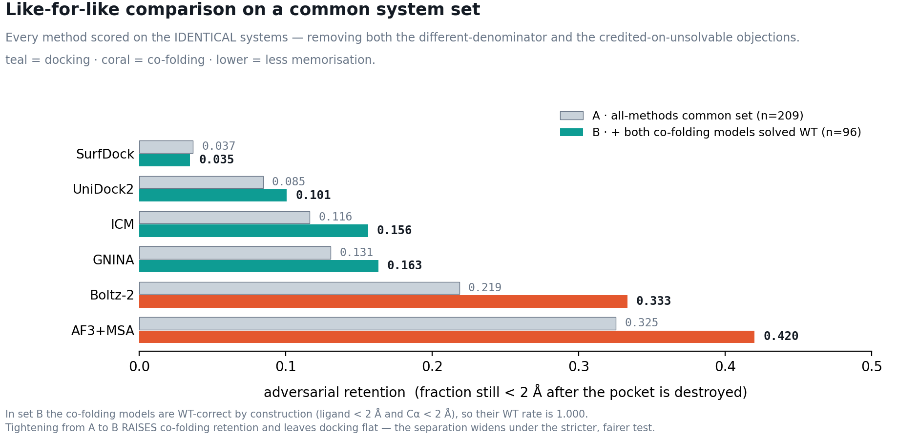
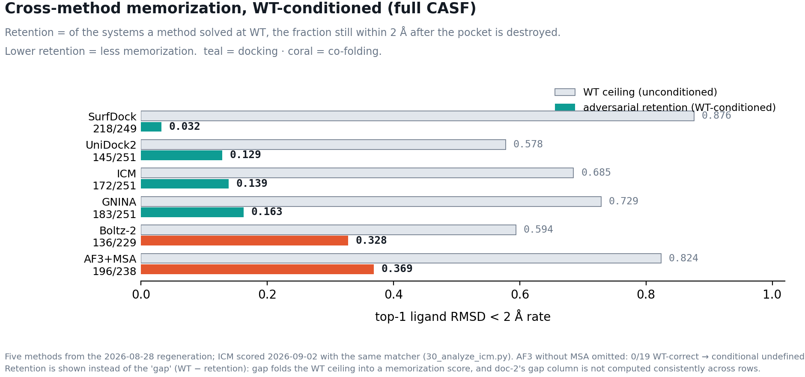
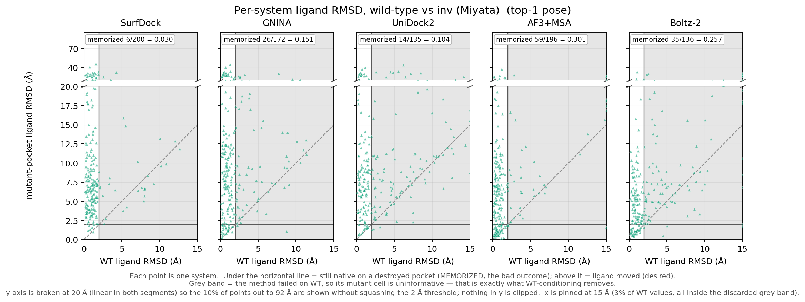
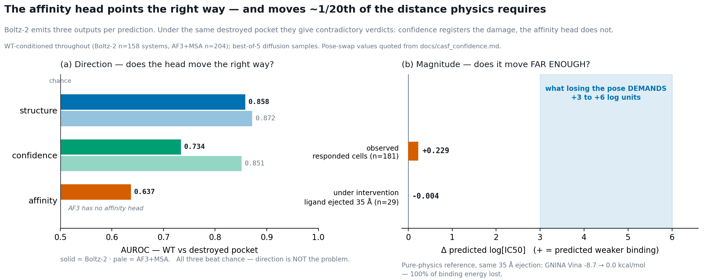
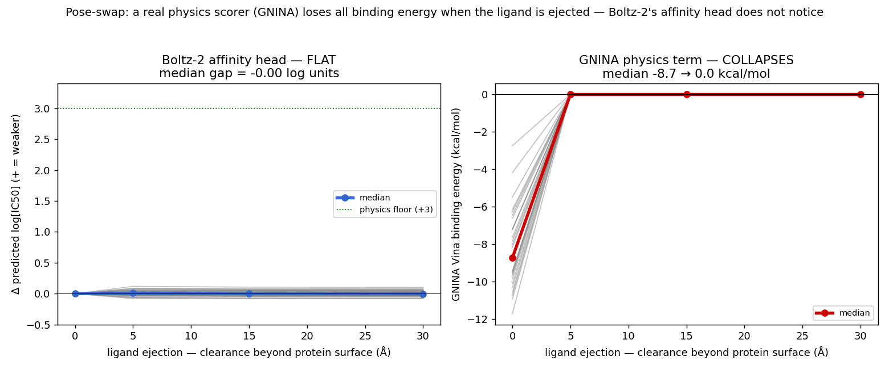
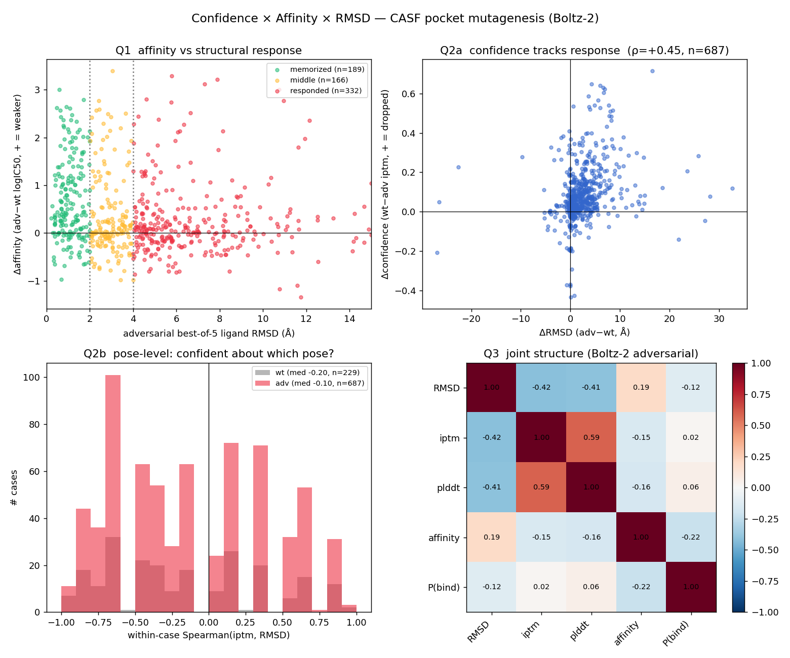

# contrasCF — Idea, Validation, Experiments

> **Local draft for review.** Merges the main idea doc (`Kg1hdTzdBoHEy9xlxANuIKqxtOh`)
> with the 2026-08 update doc (`TVLddBn1koPfiyxh88UueCU3tNB`).
> **Precedence rule: where the two disagree, the update doc wins** — it is newer and
> every number in it was regenerated after the benchmark corrections.
> Superseded text from the main doc is *deleted*, not kept alongside, so there is one
> current source of truth.
>
> Status markers used below: ✅ verified · ⏳ pending · 🔲 placeholder (not to fill yet)

---

## 1. Idea

*(from main doc §Idea, de-blobbed — its H1 currently contains the entire essay as a title)*

**Core question.** Do deep-learning co-folding models learn the physics of protein–ligand
interaction, or do they memorise sequence/structure co-occurrence? Masters et al. 2025
(*Nat. Commun.* 16:8854) showed AF3, RoseTTAFold-AA, Chai-1 and Boltz-1 keep placing the
ligand in the native pocket even under perturbations that should abolish binding.

**Our extension.** Three moves beyond the paper:

1. **Scale** — full CASF-2016 (251 systems run; 281 receptors available)
   instead of 16 hand-built cases.
2. **Breadth** — add the physics-based/docking arm (GNINA, UniDock2, SurfDock, **ICM**),
   which the paper never tested. If memorisation is a *learned-model* pathology,
   physics-based docking should not show it.
3. **Mechanism** — if the failure is that interaction-specific encoding is not innate to
   a fused protein+ligand representation, then the fix is an explicit interaction-level
   readout. That is the trained-model arm (§4).

**Framing claim.** Interaction-specific encoding is not implicit in co-folding
representations and cannot be learned by fusing ligand and protein alone.

**References**
- Masters, Mahmoud, Lill (2025) *Nat. Commun.* 16:8854 — the reference paper.
- *Do Protein–Ligand Models Learn Binding Sites or Just Binding Likelihood?*
  arXiv 2605.24045 — same concern from the VS side.

---

## 2. Validation

*What had to be true before any result could be trusted. This section absorbs the whole
of the update doc's corrections — they are validation findings, not results.*

### 2.1 Benchmark and denominator ✅

CASF-2016 core = 285 systems. 34 had no receptor under `$CASF/raw/` (HiQBind coverage
gap); **30 recovered from RCSB deposited mmCIF → `raw/` now holds 281.**

Safety argued by measurement, not assertion: all 31 non-peptide ids are absent from
HiQBind's 32,275-row metadata *entirely* (a coverage gap, not a quality veto), and running
the identical recovery on **25 systems HiQBind does have** reproduced the detected 3.5 Å
pocket **exactly on 25/25** (Jaccard 1.00). `build_system()` succeeds 30/30.

Still excluded (4): `1a30`/`3bv9`/`3uri` (peptide ligands — categorical) and `3f3a`.

> ⚠️ **The 281 is receptors, not experiments.** The recovery expanded `raw/` to 281, but
> variants and predictions were never generated for the 30 new systems — verified
> 2026-09-02: they have no output directories on katlab *or* CARC (CARC holds 251 system
> dirs; 0 prediction CIFs newer than 2026-08-20). They do appear in `results_full.csv`,
> but all 360 of their rows are `missing_cif` with no usable RMSD.
>
> **Report it as: 281 receptors available · 251 systems in the current experiment ·
> 239 with mutant docking inputs.** Quoting a bare n=281 overstates what has been run.

### 2.2 Data preparation and the data store ✅

- **Ground truth** = the deposited crystal pose (`crystal_ligands/<id>_ligand.sdf`), *not*
  the re-folded `wt` prediction.
- `crystal_ligands/` is **corpus-wide (14,661 SDFs)**, not CASF-scoped — the `$CASF`
  variable names the PDBbind clean-split root. Scope ladder:
  18,623 → 16,491 → 14,661 → 285 (CASF core) → 281 (with receptor).
- Full lab↔CARC map with the 6 host divergences: `docs/data_store_map.md`,
  machine-verified by `env/verify_data_store_map.sh`.

### 2.3 Integrity corrections ✅

**(a) AF3+MSA emitted a single chain.** The runner rebuilt a one-chain input, so for
multi-chain systems the predicted CIF came back with one chain — sometimes *not the chain
the mutations were on*. Archetype `1bcu`: chains L(26)+H(257), both mutations on H, but the
CIF held only a 26-residue chain, so that cell docked into a stub with **no mutation at all**.

| mutation-presence verdict (690 cells) | before | after |
|---|---|---|
| OK | 601 | **684** |
| PARTIAL | 65 | 0 |
| NOCHAIN / ABSENT | 18 | 0 |
| NOMUT (spec == WT) | 6 | 6 |

Truncated receptors **16 systems → 1**. Effect on AF3+MSA's own rates was material and in
the *conservative* direction — it had been **understating** memorisation.

**(b) SurfDock: retracted, then restored.** The published claim — *0/244 WT under 2 Å,
"CASF sits outside SurfDock's training distribution"* — was an artifact of our own surface
preprocessing skipping SurfDock's interface crop (we kept every mesh face: 1474 vertices
vs SurfDock's own 142 on the same pocket). **SurfDock actually reaches 87.6% WT under 2 Å
at 1.06 Å median.** Falsified three ways, incl. `1a0q` — SurfDock's *own* shipped test
system — failing identically through our pipeline (7.74 Å → 0.44 Å fixed).

**(c) Two earlier explanations were wrong — do not re-derive.** The numpy `(1,3)` vs `(3,)`
shape bug is a **no-op** (broadcasts identically); `--ligand_to_pocket_center` is
**harmful**, not the fix (it replaces the trained translational prior with a delta).

### 2.4 Metrics and failure handling ✅

Full write-up: `docs/rmsd_and_failure_handling.md`. Three things a reader must know:

1. **`ligand_rmsd_a`** = Cα-superpose on the **ligand-nearest chain**, apply R/t to the
   ligand, then symmetry-minimised heavy-atom RMSD. Nearest-chain matters: superposing on
   the largest chain scored `4w9l` WT at 47 Å on a fold that was actually correct.
2. **Failed cells are dropped, not counted as misses.** Every rate is
   *P(RMSD < 2 Å | the prediction succeeded)*, and each method has its own denominator.
3. **WT-conditioning** (§3.4) is the primary aggregation. An unconditioned rate credits a
   method for "responding" on systems it cannot solve at all.

> ⏳ **Two known metric defects, both flattering the headline claim.** (i) The docking arm
> takes a single substructure match rather than minimising over symmetry-equivalent ones —
> measured understatement ≈ 2.4 points. (ii) `ligand_rmsd_bestfit` is 100% NaN for
> `atp_charge` and 83% for `glucose`, because `GetBestRMS` cannot match ligands whose graph
> changed. Tracked as TODO 10/11.

---

## 3. Experiments

### 3.1 Pocket-mutation setup ✅

Binding-site residues (3.5 Å shell) are mutated in three ways, following Masters et al.:

| variant | rule | intent |
|---|---|---|
| `rem` | all selected residues → **GLY** | remove the side-chain chemistry entirely |
| `pack` | → **PHE** | fill the pocket with bulk |
| `inv` | → **Miyata-inverted** residue | invert physicochemical character |

### 3.2 Ligand-mutation setup ✅

| family | rule | note |
|---|---|---|
| methylation | add 1–5 methyls | steric perturbation |
| halogenation | F / Cl / Br swap | electronic + steric |
| charge swap | anionic triphosphate → **neutral alkyl** *or* → **cationic ammonium** | see below |

> **The two charge ladders are not "negative vs positive".** Both amputate the *same*
> anionic triphosphate at the same bond and differ only in the grafted tail:
> `chrg→neutral` removes the charge, `chrg→flipped` reverses it. The WT is the anionic
> one. Rungs 2 and 3 are heavy-atom matched (9 and 13), so the neutral ladder is the
> **isosteric control** for the cationic one. Empirically the two are statistically
> indistinguishable (GNINA p=0.52, UniDock2 p=0.84) — but note neither isolates charge
> alone, since both delete the whole polyphosphate.

### 3.3 Methods, setup and filtering stats

**Experiment set: 251 systems × 4 variants = 1004 cells per method.** Coverage differs by
method, and the reasons are now characterised rather than left as bare n's.

| method | kind | wt | rem | pack | inv | subtractions from 251 |
|---|---|---|---|---|---|---|
| GNINA | docking | 251 | 239 | 239 | 239 | **B** |
| UniDock2 | docking | 251 | 239 | 239 | 239 | **B** |
| ICM | docking | 251 | 232 | 233 | 232 | **B** + 6–7 cells never produced |
| SurfDock | docking | 249 | 238 | 238 | **231** | **B** + 12 documented exclusions, variant-linked |
| AF3+MSA | co-folding | 238 | 239 | 239 | 239 | **A** (12) + `2xbv` at WT only |
| Boltz-2 | co-folding | 229 | 229 | 229 | 229 | **A** (the same 22 throughout) |
| AF3 (no MSA) | co-folding | 19 | 19 | 19 | 19 | only ever run on subset20 |

**Only three mechanisms produce every number above — and two of them are the same event.**

**A · Co-folding: the prediction was never generated (`missing_cif`).** *System-level* — the
same systems are absent from all four variants, so it hits WT and mutant equally and cannot
bias the WT→mutant contrast. Boltz-2: 22 systems, giving a flat 229. AF3+MSA: 12 systems,
giving 239 — **plus one extra at WT only, `2xbv`**, which is the entire reason AF3+MSA's WT
(238) reads *lower* than its own mutants (239). These are re-runnable; nothing failed.

**B · Docking mutant arm: there is no mutant receptor to dock into.** The mutant receptor
*is* the AF3+MSA mutant CIF, so A propagates straight into docking. Verified — the two sets
are **identical**, not merely overlapping:

```
GNINA mutant-missing (12): 1o5b 1ps3 2c3i 3d4z 3dx1 3dx2 3ebp 3ejr 3g2n 3l7b 3syr 4eky
AF3+MSA missing_cif  (12): 1o5b 1ps3 2c3i 3d4z 3dx1 3dx2 3ebp 3ejr 3g2n 3l7b 3syr 4eky
```

So A and B are **one root cause counted twice**: re-running those 12 AF3 predictions restores
GNINA, UniDock2 and AF3+MSA simultaneously. Docking WT is untouched (251) because WT receptors
come from the crystal, not from AF3.

**C · Engine-specific run failures, on top of B.**

- **SurfDock — 12 cells**, two documented mechanisms: 8 "0 graphs" (7 `inv`, 1 `rem`) and 4
  MSMS-no-surface (2 `wt`, 1 `pack`, 1 `inv`). This is the **only variant-linked failure in
  the study** and the whole reason `inv` is 231 while `rem`/`pack` are 238.
- **ICM — 6–7 cells, mutant-only**: no output directory at all (`_icm_poses/<sys>/<v>/ICM`
  absent) for `1z9g 3qgy 4jxs 4kz6 4tmn 5tmn` across all three mutants, plus `3ivg` in `rem`
  and `inv` but not `pack` — which is why pack is 233 and rem/inv are 232. Of the cells that
  *were* produced, 948/948 scored ok.

**Zero analysis failures anywhere.** Every cell that exists on disk scores `ok` for every
method. Nothing above is a metric or parsing failure.

**Does any of this bias the WT→mutant contrast?** Only a failure that *correlates with
variant* can, and almost none do: co-folding is flat across all four, docking's deficit is
uniform across the three mutants. The one exception is SurfDock's 7 `inv` mesh failures.
Since failures are dropped rather than penalised (`docs/rmsd_and_failure_handling.md`), we
bound it by assuming **every** dropped cell would have been memorised:

| SurfDock (WT-conditioned) | scored | dropped | retention | worst case |
|---|---|---|---|---|
| rem | 206 | 12 | 0.024 | 0.078 |
| pack | 207 | 11 | 0.043 | 0.092 |
| inv | 200 | 18 | 0.030 | **0.110** |

> The **docking-vs-co-folding separation is safe** under this bound — co-folding `inv` sits at
> 0.257–0.301, far outside it. But **SurfDock's lead over UniDock2 is not**: 0.110 worst-case
> crosses UniDock2's 0.104, so the *within-docking* ranking should not be stated as settled
> until the 8 "0 graphs" cells are explained.

**ICM (new).** Run on CARC 2026-09-01 against `docking/receptor_aligned.pdb` — the
corrected multi-chain receptors (2026-08-25) pre-transformed into the **crystal frame**
(verified: mean Cα distance to crystal 0.80 Å / 1.61 Å, vs 65.95 / 29.75 Å untransformed),
so poses need no superposition. Scored with the *same* matcher as the other engines
(`30_analyze_icm.py`).

- **948/948 cells scored, zero failures.**
- **Parse caveat:** 228 cells (24%) fail strict RDKit sanitisation —
  `AtomValenceException: Explicit valence for atom # 12 P, 7`. Recovered by skipping only
  the valence check; heavy-atom counts still match the crystal. `parse_mode` records the
  path per cell. Without it ICM's WT would read 0.651 on n=189 instead of 0.685 on n=251.
- **Cross-check:** our RMSD tracks ICM's own self-reported value (WT 0.685 vs 0.697).
- ⏳ 251 cells lack a `FINISHED` marker — all WT. They scored fine; clean termination
  unconfirmed.

**Per-system distributions, not just rates.** `29_plot_paired_rmsd.py` renders WT-vs-mutant
scatter per method (`paired_rmsd_{rem,pack,inv}.png`): each point one system, the horizontal
line the 2 Å memorisation threshold, and a grey band marking WT failures — which is exactly
what WT-conditioning discards. ✅ ICM added as a sixth column 2026-09-03; the figures are in
§3.4b.

### 3.4 Cross-method result ✅

#### 3.4a The fair comparison — a common system set (lead with this)

Every method in a per-method table has its own denominator, and co-folding is additionally
credited on systems where it never got the fold right. Docking is *handed* a receptor;
co-folding must *predict* one, so a Cα filter is only definable for co-folding — a
Cα-conditioned table is therefore still not symmetric across arms.

The symmetric construction is a common-system intersection:

- **Set A** — systems all six methods produced for all four variants → **n = 209**
- **Set B** — A, plus **both** co-folding models solved WT (ligand < 2 Å **and** Cα < 2 Å)
  → **n = 96**. In B every method is scored on identical systems and the co-folding models
  are WT-correct by construction, so neither "different denominators" nor "credited on
  systems it cannot solve" applies to anyone.



| method | kind | A (n=209) | **B (n=96)** |
|---|---|---|---|
| SurfDock | docking | 0.037 | **0.035** |
| UniDock2 | docking | 0.085 | **0.101** |
| ICM | docking | 0.116 | **0.156** |
| GNINA | docking | 0.131 | **0.163** |
| Boltz-2 | co-folding | 0.219 | **0.333** |
| AF3+MSA | co-folding | 0.325 | **0.420** |

*(adversarial retention = fraction still within 2 Å after the pocket is destroyed; lower =
less memorisation)*

> **Tightening from A to B raises co-folding retention and leaves docking flat.** The
> separation *widens* under the stricter, fairer test — docking **0.035–0.163** vs
> co-folding **0.333–0.420**. That is the opposite of what a critic would predict if the
> effect were an artifact of unequal denominators, which is why this should lead the
> section. Cost: n=96, and that should be stated plainly — it is the price of full symmetry.

#### 3.4b Per-method WT-conditioned rates (larger n, own denominators)



Retention = of the systems a method solved at WT, the fraction still within 2 Å afterwards.

| method | kind | WT ceiling | WT-correct | rem | pack | inv | **retention** |
|---|---|---|---|---|---|---|---|
| SurfDock | docking | 0.876 | 218/249 | 0.024 | 0.043 | 0.030 | **0.032** |
| UniDock2 | docking | 0.578 | 145/251 | 0.141 | 0.141 | 0.104 | **0.129** |
| ICM | docking | 0.685 | 172/251 | 0.133 | 0.170 | 0.114 | **0.139** |
| GNINA | docking | 0.729 | 183/251 | 0.180 | 0.157 | 0.151 | **0.163** |
| Boltz-2 | co-folding | 0.594 | 136/229 | 0.368 | 0.360 | 0.257 | **0.328** |
| AF3+MSA | co-folding | 0.824 | 196/238 | 0.439 | 0.367 | 0.301 | **0.369** |
| AF3 (no MSA) | co-folding | 0.000 | 0/19 | — | — | — | *undefined* |

Adding a protein-structure filter to the co-folding arm alone barely moves it — Boltz-2
0.328 → **0.316**, AF3+MSA 0.369 → **0.368** (WT-correct 136→118 and 196→182). Co-folding
usually gets the fold right when it gets the ligand right (WT Cα < 2 Å on 77% / 87%,
medians 0.75 / 0.60 Å), so the filter removes few cells and they are not preferentially
memorisers.

**The claim.** SurfDock's WT ceiling (0.876) essentially matches AF3+MSA's (0.824) but its
retention is ~10× lower — co-folding-grade accuracy on native structures **does not
require** adversarial retention. **ICM strengthens this specifically:** a mature, purely
physics-based commercial docker, the cleanest physics baseline in the set, behaving like
the other dockers rather than like the co-folding models.

> ⚠️ **Do not use the "gap" column from the update doc.** It is not computed consistently:
> four rows use `1 − retention`, Boltz-2 alone uses `WT_uncond − retention`. Computed
> consistently Boltz-2's gap is **0.672**, not 0.266, which reorders it above AF3+MSA. The
> qualitative conclusion is unaffected. **Report retention, not gap** — gap folds the WT
> ceiling into a memorisation score, which is also why ICM's gap (+0.546) misleadingly
> ranks it below AF3+MSA despite far lower retention.

**The same numbers per system, not pooled.** A rate is compatible with many different
per-system distributions, so the bar chart above cannot settle whether co-folding's higher
retention comes from a few systems or from the whole population. The paired scatter shows it
directly — each point is one system, x = its WT RMSD, y = its RMSD once the pocket is
destroyed:



- **Below the horizontal line = memorised** (still native on a pocket that no longer exists —
  the bad outcome). **Above it = the ligand moved** (desired).
- **Grey band = the method failed on WT**, so its mutant cell is uninformative. That band is
  exactly what WT-conditioning discards, which makes the conditioning visible rather than
  asserted — read the rate off the unshaded column only.
- The dashed diagonal is "the mutation changed nothing".
- y is **broken at 20 Å**, linear in both segments, so the 10% of points out to 92 Å are shown
  without squashing the 2 Å threshold. Nothing in y is clipped.

Reading across the six panels, the difference is **population-wide, not a few outliers**: the
docking panels are nearly empty below the 2 Å line, while AF3+MSA and Boltz-2 carry a dense
band of points sitting on the floor at low WT RMSD. The per-panel rates are the same numbers
as the table above (`inv`: SurfDock 6/200, UniDock2 14/135, ICM 18/158, GNINA 26/172,
Boltz-2 35/136, AF3+MSA 59/196).

> **Denominator note.** The panel denominators are *per-variant* (systems where this method
> solved WT **and** produced this variant), so they are at or below the table's WT-correct
> column — ICM's 158 vs 172, for instance, is the 14 WT-correct systems whose `inv` cell was
> never produced (§3.3). The panel is the stricter, more honest count.

`paired_rmsd_{rem,pack}.png` are the same figure for the other two mutation cases, and
`paired_rmsd_wt_vs_mutant.png` overlays all three — but **quote the per-variant ones**: the
overlaid figure's rate is pooled across variants and matches no single CSV row.

### 3.5 Deep dives: the three heads dissociate ✅

Everything above concerns **one output** — where the structure head puts the ligand. But
Boltz-2 emits three things per prediction: a **pose**, a **confidence**, and an **affinity**.
Asking what the other two do under the *same* perturbation turns the memorisation finding
from a benchmark score into a statement about where the physics signal lives inside the
model. The answer is that the three heads **disagree with each other**.

| head | signal | behaviour when the pocket is destroyed |
|---|---|---|
| **structure** | ligand RMSD | memorises 25–33% of adversarial cells; moves the ligand otherwise |
| **confidence** | interface `iptm` | ✅ **registers the damage** — drops, and the drop scales with how far the ligand moved |
| **affinity** | log[IC50], P(binder) | ❌ **near-blind** — change is dominated by regression-to-the-mean, **not** by the structure |

The perturbation signal **is present in the model**. The confidence head reports it cleanly;
the structure head acts on it most of the time; the affinity head essentially ignores it.



**Read the figure as two separate questions, because they have different answers.**

- **(a) Direction — does the head move the right way?** Common currency: AUROC for separating
  an intact pocket from a destroyed one. **All three beat chance** (structure 0.858,
  confidence 0.734, affinity 0.637 for Boltz-2; AF3+MSA confidence 0.851). Direction is *not*
  where the affinity head fails, and any figure showing only this would understate the problem.
- **(b) Magnitude — does it move far enough?** Losing the binding pose demands **+3 to +6** log
  units. The affinity head delivers **+0.229**, and under direct intervention — ligand ejected
  35 Å, zero protein contacts — it delivers **−0.004**. A pure-physics scorer under the *same*
  ejection loses 100% of its binding energy.

**So the failure is one of magnitude, not sign.** The affinity head registers that *something*
happened and then reports a number ~1/20th of the size physics requires — which is why it
cannot function as a binding-physics readout even though it correlates weakly in the right
direction.

#### Q1 — is the affinity head reading the pose, or is it just insensitive?

Two hypotheses explain "affinity barely changes on a broken pocket": the structure
**memorised**, so affinity is *correct given a (wrong) native-like pose*; or the affinity
**module is intrinsically pose-insensitive**. These have opposite implications — the first
would make affinity a usable physics-aware reranker, the second would not.

The decisive cells are the **responded** ones, where the ligand was ejected ≥4 Å — the
clearest possible non-binder. WT-conditioned, median ΔAff there is **+0.229 log units**
(unconditioned +0.068; the conditioned value is 3.4× larger because nearly half those cells
were systems Boltz-2 cannot solve at all). Biophysics demands **+3 to +6**. So even the
corrected number sits **15–25× below** the floor.

> ⚠️ **The naive read of the strata is backwards.** The table appears to say affinity responds
> *more* when the structure memorised (+0.439) than when it responded (+0.068) — which would
> suggest local-contact sensing. It is **regression-to-the-mean**. Memorised systems are simply
> much tighter WT binders (median WT logIC50 −0.26 ≈ 0.6 µM vs +0.80 ≈ 6 µM), and tighter
> predictions have more room to drift weaker: **Spearman(ΔAff, WT affinity) = −0.63** (p=1e-77).
> Control for WT affinity with a *partial* correlation and the apparent effect evaporates:
> partial(ΔAff, absolute displacement | WT aff) = **−0.06 (n.s.)**. A faint
> partial(ΔAff, ΔRMSD | WT aff) = **+0.12** survives — ~1.5% of variance — and the pose-swap
> test below settles whether even that is real pose-reading. *(It is not.)*

#### Q2 — confidence does register the damage, and it is not RTM

Spearman(ΔRMSD, Δ`iptm`) = **+0.45** (Boltz-2), **+0.52** (AF3+MSA). Stratified, the drop is
monotonic: memorised +0.012 → middle +0.046 → responded +0.086.

Because every WT→adversarial Δ is RTM-exposed, this is checked three independent ways:

| control | result | reading |
|---|---|---|
| partial out WT `iptm` | ρ 0.445 → **0.437** | essentially unchanged |
| does it persist off the ceiling? | low-WT-`iptm` half still drops **69%** (median Δ +0.046) | RTM would push these *up*; they fall |
| residual of `iptm_adv ~ iptm_wt` (slope 0.80) | corr(residual, displacement) = **−0.41** (p=1e-28) | displacement drives confidence *beyond* RTM |

Three further controls rule out a trivial explanation: **global** `ptm` drops 3–6× less than
interface `iptm` (the protein still folds — Cα ≈ 1 Å, so this is an *interface* signal, not a
folding failure); a **broken no-MSA AF3** null shows ~zero drop (AUROC 0.54); and the observed
WT→adv drop is **3.1× the within-system noise** across the 5 diffusion samples.

**AF3+MSA is sharper than Boltz-2** at full CASF (n=239): `iptm` falls 0.96 → 0.80–0.85, with
**AUROC 0.83–0.88** vs Boltz-2's 0.67–0.69, and `inv` hits hardest — matching the structure
side.

**The sharp result — the model "knows it memorised."** Restrict to cells where the *structure
memorised* (WT correct **and** adversarial RMSD < 2 Å) and confidence *still* drops: Boltz-2
Δ+0.011 (AUROC 0.65), **AF3+MSA Δ+0.030 (AUROC 0.91)**. Where the structure responded it drops
~8× more. So confidence registers the broken pocket **even when the pose output does not move**.

#### Q3 — the two heads' responses are decoupled

On adversarial cells, RMSD drives confidence (**−0.42**) far more than it drives affinity
(**+0.19**), and the confidence↔affinity link is weak (−0.15) — roughly half of which is shared
dependence on RMSD (partial | RMSD = **−0.08**). Most directly:

**Δ`iptm` ↔ ΔAff = −0.025 (n.s.)**, partial | ΔRMSD = −0.067. *Getting less confident does not
come with predicting weaker binding.* The two heads respond to the same mutation independently.

#### The pose-swap test — the capstone

Q1–Q3 are observational and leave the faint +0.12 ambiguous. The pose-swap test removes it by
**intervention**: hold the trunk byte-identical and hand the affinity head a *supplied* pose
with the ligand rigidly ejected beyond the protein's bounding sphere. Boltz-2's affinity head
reads pose only through a distogram over protein–ligand cross-pairs, so this isolates the
pose channel exactly.

**This design is also immune to the WT-conditioning confound** — it operates on fixed systems
with the trunk held constant, so WT-correctness never enters. It is the strongest evidence in
the study, and the claim should lean on it rather than on the strata.



**Result (n=29 systems, ligand ejected to a median 35 Å — zero protein contacts):**

| scorer | response to a 35 Å ejection | notices? |
|---|---|---|
| **Boltz-2 affinity head** | median gap **−0.004** log units; **0/29** weaken by ≥+1; Wilcoxon **p=0.27** | ❌ no |
| **GNINA Vina** (pure physics) | **−8.7 → 0.0** kcal/mol; **100%** of systems lose all binding energy | ✅ completely |
| **GNINA CNNscore** (learned pose-quality) | 0.95 → 0.54 — collapses for 21%, floors for the rest | ⚠️ partially |

A ligand floating 35 Å in solvent is predicted to bind **essentially as well as the native
pose**. The +0.12 was not pose-reading. And the three-way contrast is the cleanest statement of
the thesis in the whole study: the **physics** term collapses completely, while the **learned**
heads memorise to different degrees — GNINA's CNN partly, **Boltz-2's affinity head totally**.

#### Why this matters

- **The fix belongs in the trunk, not the head.** The physics features exist — the interface
  representation registers the broken pocket cleanly and proportionally — but the affinity head
  does not consume them. Retraining an output head cannot recover a signal that head never
  reads. *(Direct evidence for CounterFold H5; see §4.)*
- **It rules out the optimistic fallback** that the affinity head could serve as a
  physics-aware reranker on top of a memorising structure head.
- **Practically: dropped interface confidence is a usable flag** for untrustworthy co-folding
  predictions (pose-level AUROC 0.80–0.86). **The affinity number is not.**

#### Supporting analysis panels

The four panels behind the claim — the Q1 strata, the Q2a ΔRMSD↔Δconfidence cloud, the Q2b
within-case pose-level histogram, and the Q3 correlation matrix:



> **Currency check (2026-09-03).** This figure predates the August AF3 multi-chain re-run, so it
> was re-verified against the current `results_full.csv`: n=189/166/332 and ΔAff
> +0.439/+0.066/+0.068 reproduce **exactly**, ρ +0.445 vs +0.45. It is Boltz-2-only, and the
> August re-run fixed AF3+MSA, so nothing in it moved. ⚠️ Note it shows the **unconditioned**
> strata; the +0.229 quoted above is the WT-conditioned re-check (independently reproduced live).

> **Caveats.** Single seed (42); the 5-sample diffusion spread gives a noise floor but is not a
> substitute for multi-seed. Affinity is emitted **per system**, not per pose, so no pose-level
> affinity analysis is possible — which is exactly why the pose-swap intervention was needed.
> Pocket axis only — the ligand axis is the next extension.

---

## 4. Trained model — CounterFold 🔶

> **Status: standalone arm works and is pre-registered-passed; co-folding integration not done;
> single-seed on ≤60 systems.** Written up here because the *mechanism* is settled and it answers
> §3.5 directly. Not yet decision-grade — do not quote as a headline result.

§3.5 ends on a design constraint: **the physics features exist in the trunk, but the affinity head
does not consume them**, so retraining an output head cannot recover a signal that head never reads.
CounterFold is the attempt to install that sensitivity. Its value here is partly the negative
results — two plausible routes were built and refuted before the one that works.

### 4.1 The goal

Make a co-folding model **report** that interactions are physically destroyed, rather than
confidently emitting a plausible bound complex. Two requirements: correctly predict
protein–ligand interactions, *and* flag their absence.

### 4.2 Route 1 — physics-decomposed affinity head ✅ (offline)

A typed head `a = baseline + Σ_type w_type·g_type(evidence)`, `w_type ≥ 0`, where an
`InteractionTyper` computes per interaction class (K=10) a learnable Gaussian over ligand–pocket
distance × a chemical-compatibility gate. A genuine differentiable interaction reader (family:
PIGNet; labels from PLIP).

- **Type-awareness is what makes it directional.** A type-*blind* pooled head is **fooled by
  atom-adding perturbations** — it rates `pack`(→Phe) and `inv`(→Trp) destroyed pockets as
  *better* binders. Only the typed head stays directionally consistent.
- **Trained offline on the fixed crystal pose** with a contrastive δ-margin loss: held-out WT-vs-
  mutant gap **+0.98**.
- **The anti-drift anchor does real work.** Ablating it ballooned `a(WT)` from +6 to **+48.5** —
  the model satisfied the margin by decalibrating everything rather than by learning chemistry.

> **The load-bearing lesson:** the affinity gap has **two independent factors** — head *chemistry*
> (installable offline) and *structural reaction* (the co-folding model's job). Conflating them in
> one fine-tune fails: inside FLOWR's LoRA fine-tune the head barely trained (0.04–0.67% weight
> change) and the apparent training "gap" was **pose-mediated** — a fixed-pose eval showed the head
> sitting at its warm-start value.

### 4.3 Route 2 — `L_pose` pose-divergence loss ❌ REFUTED

Fine-tune the co-folding model so the mutant ligand pose diverges from the WT pose, on the theory
that a destroyed pocket should push the ligand off its trapped pose.

Pre-registered threshold **≥ +0.30**; observed **S_ft − S_frozen = −0.23**.

**And the way it failed is the interesting part.** Raw δ=3 divergence *rose*, 4.18 → 7.38 Å, which
looks exactly like de-trapping. But the **WT-self noise floor rose more**, 4.38 → 7.81 Å: the
fine-tune inflated pose variance **uniformly** rather than displacing the ligand where physics said
it should move. Without the pre-registered WT-self control this would have been reported as a
success.

> **Root cause:** `L_pose` rewards *any* WT↔mutant divergence, so it has a degenerate solution —
> inflate global pose variance. Pose RMSD is a downstream **symptom**: "move" ≠ "move correctly".
> Structurally the same degeneracy the anchor fixed in 4.2.

### 4.4 Route 3 — interaction-recovery head ✅ the mechanism

Stop detecting "interaction lost" *through the pose*. Supervise at the **interaction level**.

**Why it works — pose-trapping robustness by construction.** When Ser→Gly, the OG donor atom is
*gone*, so the chemistry gate zeroes that H-bond **regardless of where the ligand sits**. No pose
motion is required, which is precisely the failure mode that sank Route 2.

#### 4.4.1 Training data — self-generated counterfactuals from crystals

**Source.** CASF-2016 **crystal** complexes: `raw/<id>/<id>_protein.pdb` +
`crystal_ligands/<id>_ligand.sdf`. Crystal, not co-folded, so labels are *physically* correct rather
than "reproduce the generator".

**Labels.** PLIP 2.3.0 on the crystal complex → `T_wt[k, r]` ∈ {0,1}, a binary presence map over
(interaction class `k`, pocket residue `r`). The pocket is every residue within **8 Å** of the ligand.

**Counterfactuals are generated, not collected.** For each **key residue** — one carrying at least one
side-chain-mediated interaction — build a single-residue side-chain-removal variant: keep backbone
N/CA/C/O, drop the side chain, **hold the ligand pose fixed**. Physics then gives the label for free:

- `dead` = that residue's side-chain interactions → must read 0
- `alive` = everything else → must persist unchanged

This is the design's central trick. **No mutant structures are needed and no model is in the loop** —
the supervision comes from the chemistry of what atoms remain.

> **Why co-folded mutants cannot be used as labels.** The obvious alternative — diff PLIP(WT) against
> PLIP(co-folded mutant) — was prototyped on 8 systems and **rejected**: the co-folded mutant re-docks
> the ligand 0.8–9.2 Å, so only **63% of untouched contacts survive** and **35% of contacts are new and
> spurious**. The signal (median 38% of interactions killed) is the same size as the noise. Crystal
> single-residue removal avoids the whole problem.

**A labelling gotcha that had to be handled.** PLIP reports `residue_atom` as an *OpenBabel atom type*,
not a PDB atom name, so the backbone/side-chain split needs a residue-aware map (`Nam` = backbone amide
donor, `O2` = backbone carbonyl, `O3` = Ser/Thr/Tyr side-chain OH, `Ng+`/`N3+` = Arg/Lys side chain).
A naive `{N, CA, C, O}` test is wrong. Asn/Gln/Asp/Glu remain ambiguous (0–2 per system) and are
resolved against the actual PDB atom.

#### 4.4.2 Architecture — a physics-shaped reader with ~40 parameters

Per ligand atom `L` and pocket atom `P`, each interaction class `k` gets a **membership**:

```
memb_k(L,P) = clamp(gate_k(chem_L, chem_P), 0, 1) · exp( −(d(L,P) − μ_k)² / 2σ_k² )
                        ↑ chemical compatibility          ↑ learnable radial window
```

- **`gate_k`** is a product of 7 boolean atom flags — `donor, acceptor, positive, negative, aromatic,
  hydrophobic, halogen` — one rule per class over **K = 10** classes (`HBDonor`, `HBAcceptor`,
  `Cationic`, `Anionic`, `XBDonor`, `XBAcceptor`, `PiStacking`, `CationPi`, `PiCation`, `Hydrophobic`).
  The gates are **directional**: `HBDonor = protein_donor × ligand_acceptor`, `HBAcceptor` the reverse.
  Desymmetrising them is what makes the two classes distinct instead of degenerate; grounding XB in the
  halogen flag separates it from HB.
- **`μ_k`, `log σ_k`** are the *only* typer parameters — initialised to per-class distance priors and
  learned. **That is 2 × 10 = 20 numbers.**

**The local tap** is the addition that makes interaction-level supervision possible. The original head
pooled everything to a global `(K,3)` vector for affinity; the tap keeps the residue axis:

```
E[k, r] = Σ_{P ∈ residue r} Σ_L  memb_k(L, P)          # (K, R)
```

implemented as an `index_add_` over a pocket-atom→residue index. The global `(K,3)` affinity path is
left unchanged, and summing `E` over `r` recovers the global evidence channel exactly — an invariant
the unit tests assert.

A second variant, `local_evidence_split`, returns `(E_sidechain, E_backbone)` by partitioning the
contributing pocket atoms. This is what later makes the backbone/side-chain mediation analysis possible.

**Evidence → probability** is a per-class affine calibrator, `logit = softplus(a_k)·E[k,r] + b_k`, with
`softplus` enforcing `a_k ≥ 0` so **more evidence can only mean more interaction** (a monotonicity
constraint, not a free fit), and `b_k` initialised to −1.0, i.e. a prior of "absent". That is another
2 × 10 = 20 parameters.

> **The whole trainable model is ~40 parameters.** It has no capacity to memorise a 285-system
> benchmark; essentially all of the performance below comes from the physics-shaped inductive bias.
> That is the strongest argument that the head is reading chemistry rather than fitting the dataset.

#### 4.4.3 Loss — three terms, no pose term

```
L = λ_recover · BCE( σ(a·E_wt + b),        T_wt )              # (1) reproduce PLIP on the WT crystal
  + λ_vanish  · BCE( σ(a·E_cf + b)[dead],  0    )              # (2) removed side chain → no interaction
  + λ_persist · BCE( σ(a·E_cf + b)[alive], T_wt[alive] )       # (3) survivors are unchanged
```

with `λ_recover = λ_vanish = λ_persist = 1.0`. Term (1) is evaluated **once per system** on the WT;
terms (2) and (3) are evaluated **once per key residue**, each on that residue's counterfactual.

Because positives are only ~10% of cells, `recover` is class-weighted with
`pos_weight = negatives/positives` per class, clamped to [1, 30].

**There is deliberately no pose term.** Sensitivity comes from the chemistry gate, not from ligand
motion — which is precisely the property Route 2 lacked and the reason it had a degenerate solution.

#### 4.4.4 Training

Head-only and fully offline: **no generative model is in the loop**, so the whole thing is testable
without FLOWR or Boltz.

| | |
|---|---|
| optimiser | Adam, lr **1e-2** |
| epochs | **80** |
| batching | one system per step (full-batch over that system's counterfactuals) |
| split | **25% held out**, split by **complex**, not by residue — so generalisation is to unseen proteins |
| pocket | 8 Å around the ligand |
| scale | ≤ 60 systems, single seed |

#### 4.4.5 Results

| test | result | pre-registered bar |
|---|---|---|
| **crystal, held out** — does it predict real interactions? | recover-AUROC **0.955** | PASS |
| **crystal counterfactual** — does the removed interaction read off? | P(dead) **0.575 → 0.031**, ~**18×** drop, on an *unchanged* pose | PASS |
| **transfer B** — co-folded `rem` structure | mutated 0.994 vs unmutated 0.395 → **Δ +0.599** | ≥ +0.30 ✅ |
| **transfer A** — pose-free counterfactual on co-folded WT | mutated 0.942, control **0.000 false-positive** | ≥ +0.30 ✅ |
| **refined A** — side-chain-mediated cells only | **0.993** (n=144), control 0.000 | load-bearing |

The transfer test is the thesis check: take the head trained *only* on crystals and apply it to the
**co-folding model's own output structures**. Metric B passes even through the re-docked-pose confound;
metric A is the head's intended serve-time use and passes with zero false positives.

#### 4.4.6 Analysis

**The refinement cuts the right way.** The headline 0.942 was **diluted by backbone survivors that
correctly persist** — Gly keeps its backbone N and O, so backbone H-bonds *should not* die, and killing
them would have been the error. Splitting by mediation (`local_evidence_split`) raises the should-die
rate to **0.993** and isolates the claim properly. A residual mixed cell remains: backbone-mediated
interactions on mutated residues sit at 0.438 (n=16), where the hard `E_sc > E_bb` threshold is too
crude — a continuous mediation weight is the open fix.

**Honest negative — calibration did not improve.** Class-weighted `recover` training did **not** sharpen
absolute calibration (mean P on real interactions 0.559 → 0.542). Present and absent evidence overlap,
and an affine `a·E + b` cannot separate them. This does not affect the result — the counterfactual runs
on the **relative** drop between `E_wt` and `E_cf`, not on absolute confidence — but it does bound the
head to *comparative* calls and rules out using it to score a single structure in isolation.

**What the ~18× drop actually demonstrates.** It is measured **on an unchanged pose**. Nothing moved;
only the atoms present changed. That is a direct measurement of the pose-trapping robustness the design
claims, rather than an inference from a correlation — and it is the property that neither the affinity
head (§3.5) nor `L_pose` (§4.3) had.

### 4.5 Why this answers §3.5

The head needs only the generator's **WT** pose plus a deterministic side-chain edit. It does
**not** depend on the co-folding model predicting the mutant well — which §3 shows it does not.
That decouples the physics readout from the exact failure §3.5 diagnosed: the signal is read at
the interaction level, where it survives, instead of through the affinity head, which cannot see it,
or through the pose, which is gameable.

### 4.6 What is missing before this is decision-grade

- [ ] **Full CASF + ≥3 seeds.** Currently single-seed on ≤60 systems.
- [ ] **Co-folding integration** — FLOWR/Boltz feed structures to this head; not built.
- [ ] Use `applied_mutations` for the mutated set rather than the WT-vs-`rem` pocket diff, and a
      *continuous* backbone/side-chain mediation weight — the hard `E_sc > E_bb` split leaves a
      mixed backbone-on-mutated cell at 0.438 (n=16).
- [ ] Absolute calibration (~0.55) if single-structure calls are ever needed; a per-class MLP
      readout would fix it.

*All CounterFold work is on the isolated `worktree-counterfold` branch, not `main`; FLOWR edits on
FLOWR branch `counterfold-contrastive`. Sources: `docs/CounterFold_progress_2026-07-08.md`,
`journal/2026-07-08-*`, spec `2026-07-07-interaction-recovery-head-design.md`.*

---

## 5. Open threads

**From the update doc**
- [ ] 8 of SurfDock's 12 exclusions fail with "0 graphs", cause unestablished; 7 of 8 are `inv`.
- [ ] SurfDock is single-seed (seed 42, 40 samples/complex). The WT/adversarial gap is far
      too large to be seed noise, but adversarial rates (0.026 vs 0.046) should not be
      compared to each other without ≥3 seeds.
- [ ] SurfDock has no ligand-mutation arm.
- [ ] Docking WT receptors come from crystal, mutants from AF3-predicted CIFs — the
      WT→mutant drop still conflates mutation with a crystal→predicted change.

**New / carried from the data-prep TODO**
- [ ] Fix or drop the inconsistent "gap" column (§3.4).
- [ ] **Generate variants + predictions for the 30 recovered systems** so the experiment
      actually reaches 281 (currently receptors 281 / experiment 251).
- [ ] Re-run the 22 Boltz-2 and 12–13 AF3+MSA `missing_cif` systems — these are incomplete
      GPU runs, not intrinsic failures, and would lift both co-folding denominators.
- [x] ~~Add ICM as a sixth column to `29_plot_paired_rmsd.py`.~~ Done 2026-09-03 — all four
      paired figures regenerated with six columns.
- [ ] Symmetry-correct the docking matcher (≈ +2.4 points) — TODO 10.
- [ ] `ligand_rmsd_bestfit` NaN for modified ligands — TODO 11.
- [ ] ICM: confirm the 251 WT cells without `FINISHED`.
- [ ] `3mss`/`4eo8` mutant specs identical to WT (impact ≤0.003, but fix the generator).

**§3.5 — deeper analysis of the three heads** (deferred 2026-09-03; the section states the
claim, these would harden it)
- [ ] **Regenerate `conf_aff_rmsd_pocket.png` WT-conditioned** so the figure's strata match the
      +0.229 in the text. Currently figure = unconditioned (n=189/166/332), text = conditioned.
- [ ] **Multi-seed.** Everything in §3.5 is seed 42. The 5-sample diffusion spread gives a noise
      floor (the WT→adv `iptm` drop is 3.1× it) but is not a substitute for ≥3 seeds.
- [ ] **Per-variant breakdown of the three heads.** The text says `inv` hits confidence hardest,
      matching the structure side — it is asserted, not shown. A rem/pack/inv split of the AUROC
      and Δ would show whether all three heads share the same dose-response.
- [ ] **Extend to the ligand axis** (`results_ligand.csv` — halo/meth/charge). Identical columns;
      the pocket axis is the only one analysed. A pose-blind affinity head should fail there too,
      and *differently* — ligand edits change the chemistry the head reads directly.
- [ ] **The affinity finding rests on one model.** Boltz-2 is the only arm with an affinity head,
      so "co-folding affinity heads are pose-insensitive" is currently an n=1 claim about a
      specific head. Flag as a limitation or find a second model.
- [ ] **Pose-swap n=29 is small.** It is the load-bearing intervention; widening it (or adding
      intermediate clearances) would tighten the strongest evidence in the study.
- [ ] Quantify what the residual partial(ΔAff, ΔRMSD | WT aff) = +0.12 actually is, now that
      pose-reading is excluded.

**Parked ideas from the main doc** (kept, not deleted): τRAMD / funnel-metadynamics layers;
decoy-pocket and pocket-redirection tests ("the paper tests perturbations that destroy
binding but never ones that create or redirect it"); energy minimisation post-prediction;
pocket-based vs blind docking; testing GPCR/kinase targets.
