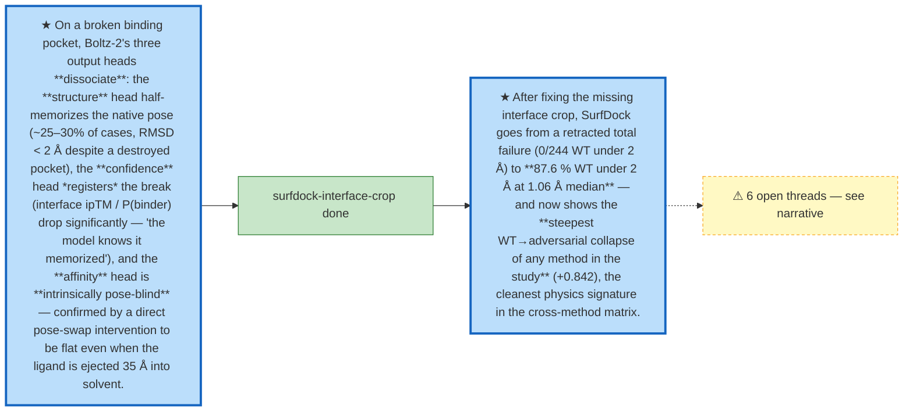

# Storyline — contrasCF

<!-- lab-notebook:generated -->

## Where we started
- [three-head-dissociation](../journal/2026-06-30-three-head-dissociation.md) — On a broken binding pocket, Boltz-2's three output heads **dissociate**: the **structure** head half-memorizes the native pose (~25–30% of cases, RMSD < 2 Å despite a destroyed pocket), the **confidence** head *registers* the break (interface ipTM / P(binder) drop significantly — "the model knows it memorized"), and the **affinity** head is **intrinsically pose-blind** — confirmed by a direct pose-swap intervention to be flat even when the ligand is ejected 35 Å into solvent. (2026-06-30)

## Key turns
- **2026-08-28 · result** — [surfdock-interface-crop](../journal/2026-08-28-surfdock-interface-crop.md) — decisions: Vertex-count health check documented in the `dockstrat` skill and in `SURFDOCK_FIX.md`: `grep "element vertex" <work_dir>/surface/<case>/*_8A.ply` — healthy is 60–260; ~1500+ means the crop regressed.; `dockstrat` skill gotcha 6d, `references/surfdock.md` and `references/hosts.md` corrected — they previously *recommended* `--ligand_to_pocket_center` as the cure, i.e. the skill would have re-introduced the smaller half of this bug.; Recorded the PoseBusters reference point (0.98 Å median / 80 % under 2 Å) as the cross-check: a SurfDock sweep far off that on ordinary WT systems is preprocessing, not the model.; `TMPDIR` redirect + janitor documented — `computeMSMS` writes four scratch files per call (~3.6 MB/cell) into `tempfile.gettempdir()` and never deletes them; on this host `/` is a 49 GB partition with ~1 GB headroom, so a full sweep fills it (see Blast radius).; All **968** SurfDock cells were invalid and have been regenerated. The pre-fix cells are preserved at `analysis/casf_mutagenesis/outputs/_surfdock_invalid_backup/` (159 MB) rather than deleted, so the retracted numbers stay auditable.; `docs/casf_overview.md`'s SurfDock section and the SurfDock bar in `figures/overview_full.png` were wrong and are retracted; the figure has been regenerated from the corrected sweep.; `SURFDOCK_FIX.md` documented a fix that does nothing, and the shared install at `/home/aoxu/projects/SurfDock` needs **no** patch. Anyone who applied `apply_surfdock_fix.py` changed nothing.; No other engine is affected — GNINA and UniDock2 do not use the SurfDock surface path, and their numbers were regenerated independently under `e46d2ea`.
- **2026-08-28 · manual** — [surfdock-restored-physics-signature](../journal/2026-08-28-surfdock-restored-physics-signature.md) — decisions: Rewrite the retracted `docs/casf_overview.md` SurfDock section with these numbers, the per-variant n, and the 12 exclusions; the figure is already regenerated. · After fixing the missing interface crop, SurfDock goes from a retracted total failure (0/244 WT under 2 Å) to **87.6 % WT under 2 Å at 1.06 Å median** — and now shows the **steepest WT→adversarial collapse of any method in the study** (+0.842), the cleanest physics signature in the cross-method matrix.

## Where we landed
- [surfdock-restored-physics-signature](../journal/2026-08-28-surfdock-restored-physics-signature.md) — manual

## Open threads
- [open] Delete the merged `pose-swap` branch (local + remote) once the merge is confirmed stable on `main`. — [three-head-dissociation](../journal/2026-06-30-three-head-dissociation.md)
- [open] Cause of the 8 "0 graphs" failures is still unknown — see Blast radius. — [surfdock-interface-crop](../journal/2026-08-28-surfdock-interface-crop.md)
- [open] **8 cells fail with "0 graphs" and I do not know why.** My first explanation — degenerate meshes below SurfDock's ~59-vertex floor — is **refuted** by the mesh census (`analysis/casf_mutagenesis/mesh_census.json`): failed cells span 42–158 vertices while successful ones span 7–166, so mesh size does not predict failure. 7 of 8 are `inv`, so the cause is variant-linked, but that is all that is established. — [surfdock-interface-crop](../journal/2026-08-28-surfdock-interface-crop.md)
- [open] The sweep's first attempt died at cell 477/968 with ENOSPC after MSMS scratch filled the 49 GB root partition. Root-fs headroom on this host is a standing hazard for any long job, not just SurfDock; the `TMPDIR` redirect works around it but does not fix the partition. — [surfdock-interface-crop](../journal/2026-08-28-surfdock-interface-crop.md)
- [open] 8 of the 12 exclusions fail with "0 graphs" and the cause is unknown. Mesh size does **not** predict it (failed 42–158 vertices vs succeeded 7–166, `analysis/casf_mutagenesis/mesh_census.json`); 7 of 8 are `inv`, so it is variant-linked and nothing further is established. — [surfdock-restored-physics-signature](../journal/2026-08-28-surfdock-restored-physics-signature.md)
- [open] Single seed (seed 42, 40 diffusion samples per complex). The WT/adversarial gap is far too large to be seed noise, but the per-variant adversarial rates (0.026 vs 0.046) should not be compared to each other without ≥3 seeds. — [surfdock-restored-physics-signature](../journal/2026-08-28-surfdock-restored-physics-signature.md)
